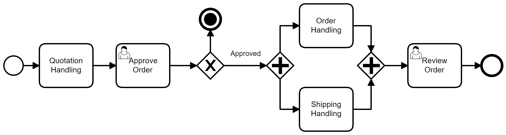

# SU CASA

**André Sathleer, email do aluno 1**

**Bruno Vieira Cardoso, brunogrupo@gmail.com**

**Gustavo Henrique Dos Santos Riegert, ghsriegert@sga.pucminas.br**

**Nicolás Melo Chabot, email do aluno 4**

**Yuri Lucas, email do aluno 5**

---

Professores:

**Hugo Bastos de Paula**
**Joyce Christina de Paiva Carvalho**

---

_Curso de Engenharia de Software, Unidade Praça da Liberdade_

_Instituto de Informática e Ciências Exatas – Pontifícia Universidade de Minas Gerais (PUC MINAS), Belo Horizonte – MG – Brasil_

---

**Resumo**

O sistema é uma opção interessante para proprietários de imóveis conseguirem uma nova fonte de receita. Portanto, esse sistema pode ser replicado para diversas outras residências, permitindo assim a geração de receita para outros proprietários.

---

## 1. Introdução

Organização de eventos, inclusive os de pequeno porte, demandam trabalho e tempo por parte de quem os organiza. Uma residência é sinônimo de um lar, mas também de despesas recorrentes para seus donos. E se houvesse uma forma de resolver essas duas questões através de uma única forma?
Esta foi a ideia que norteou a criação da aplicação Su Casa, na qual o proprietário transforma sua residência em um local para eventos, logo sua casa começa a gerar receita, e o promotor consegue fechar a contratação de todo staff através de um clique, economizando tempo e, portanto, dinheiro. 

    1.1 Contextualização

Residências são consideradas ativos na classificação contábil. Contudo, trata-se de um ativo que gera despesas recorrentes, como manutenções, tributos etc. Desta forma, o custo para se manter um imóvel é alto. Portanto, uma solução para reduzir esses impactos financeiros seria a geração de receita. Isto é, o imóvel passar a gerar receitas recorrentes para seu proprietário e não apenas despesas.

A primeira coisa que vem à mente seria disponibilizar o imóvel para locação – integral ou de alguns cômodos. Entretanto, quando o proprietário reside no imóvel, essa opção se torna, às vezes, inconveniente.

O proprietário do imóvel que inspirou a criação da aplicação, identificou que as despesas envolvendo sua casa custavam anualmente aproximadamente R$ 30 mil. A partir disso, ele começou a procurar maneiras para reduzir as despesas. Contudo, a principal delas era compulsória: o IPTU. As demais eram manutenções necessárias. Desta forma, não restou muito para se fazer em relação as despesas.

Assim, a única solução viável seria a geração de receitas – com uma ressalva: ele não deixaria de morar em sua casa. Cogitou alugar alguns cômodos. Porém, a ideia de se ter por vários dias algumas pessoas dentro de sua casa, o fizeram desistir. Cogitou, em seguida, alugar seu imóvel para temporada. Contudo, isso feria sua regra inicial, pois por alguns dias não poderia morar em sua casa. Além disso, a ideia de desconhecidos presentes por vários dias em sua residência sem a sua presença, lhe causava desconforto.

Por fim, surgiu a ideia de alugar a parte externa de sua casa para eventos conforme sua conveniência. Desta forma, ele receberia por este aluguel, não precisaria deixar sua residência, preservaria sua intimidade, estaria presente no local e não teria pessoas por mais de um dia ali.

Contudo, havia uma ressalva: ele gostaria de ter algum controle sobre as pessoas que trabalhariam nos eventos. Sabendo que organizar eventos sempre demandou muita energia de quem os promove, principalmente em razão da gama de fornecedores que envolvem a atividade, ele identificou uma oportunidade que solucionaria essa questão: a equipe seria cadastrada previamente no sistema. Assim, ele teria o controle de quem estaria trabalhando em sua casa e o promotor de eventos teria a facilidade de não ter que buscar mão de obra para a realização do seu evento.

Logo, o sistema que disponibilizaria o espaço para a realização do evento, faria a seleção automática do staff, com base nos profissionais cadastrados no sistema, facilitando consideravelmente a realização do evento para o promotor e trazendo mais segurança para o proprietário.

Através do Su Casa, o proprietário rentabiliza um ativo que antes apenas gerava despesa, o staff tem mais oportunidades de trabalho e o promotor do evento ganha tempo e facilidade na realização da sua festa.

    1.2 Problema

Promover um evento sempre demandou muito gasto e tempo procurando equipe e local, com a chegada da pandemia em 2020 e sua flexibilização em 2022 esse cénario piorou devido ao aumento da procura e a oferta mais cara. Assim a equipe por tras do su casa identificou um dos problemas sendo: "Locação de espaço e staff de forma rápida e permitindo contato direto entre usúario e locatário". Ou seja o usúario tem dificuldade de encontrar local e staff para promover o evento e o staff tem dificuldade em encontrar emprego em eventos devido ao elevado custo cobrado em casa de festas que cedem o salão com valor pre definido. 

Além disso ser o dono de um local exige um gasto alto com despesas de IPTU, contas de água, luz, internet. Assim vimos também o imbróglio das despesas elevadas e a fonte de renda enxuta, necessitando de uma renda extra.

    1.3 Objetivo geral
    
Criar um sistema que potencialize ao máximo a locação do local e geração de receita para o proprietário.

        1.3.1 Objetivos específicos

Oferecer ao promotor de evento um serviço de agendamento do local e contratação de staff de forma simples e eficiente.

Oferecer ao staff um sistema user friendly para cadastro e registro de disponibilidade.

    1.4 Justificativas

O sistema é uma opção interessante para proprietários de imóveis conseguirem uma nova fonte de receita. Portanto, esse sistema pode ser replicado para diversas outras residências, permitindo assim a geração de receita para outros proprietários.

## 2. Participantes do processo

Apresente aqui os diferentes perfis dos Stakeholders (participantes do processo) chave do sistema. Diversas são as informações que podem ser relevantes para a definição dos perfis dos usuários, tais como idade, gênero, aspectos culturais, nível de educação, entre outros. A pesquisa de mercado pode ser uma ferramenta poderosa para se identificar e caracterizar os perfis de usuários.

## 3. Modelagem do processo de negócio

## 3.1. Análise da situação atual

Apresente uma descrição textual de como os sistemas atuais resolvem o problema que se propoe a resolver.  Caso sua proposta seja inovadora e não existam processos claramente definidos, **apresente como as tarefas que o seu sistema pretende implementar são executadas atualmente**, mesmo que não se utilize tecnologia computacional.

## 3.2. Descrição Geral da proposta

Apresente aqui uma descrição da sua proposta abordando seus limites e suas ligações com as estratégias e objetivos do negócio. Apresente aqui as oportunidades de melhorias.

## 3.3. Modelagem dos Processos

### 3.3.1 Processo 1 – NOME DO PROCESSO

Apresente aqui o nome e as oportunidades de melhorias para o processo 1. Em seguida, apresente o modelo do processo 1, descrito no padrão BPMN.

### 3.3.2 Processo 2 – NOME DO PROCESSO

Apresente aqui o nome e as oportunidades de melhorias para o processo 2. Em seguida, apresente o modelo do processo 2, descrito no padrão BPMN.

## 4. Projeto da Solução

### 4.1. Detalhamento das atividades

Descrever aqui cada uma das propriedades das atividades de cada um dos processos. Devem estar relacionadas com o modelo de processo apresentado anteriormente.

#### Processo 1 – NOME DO PROCESSO

**Nome da atividade 1**

| **Campo** | **Tipo** | **Restrições** | **Valor default** |
| --- | --- | --- | --- |
| [Nome do campo] | [Área de texto, Caixa de texto, Número, Data, Imagem, Seleção única, Múltipla escolha, Arquivo, Link, Tabela] |  |  |
| ***Exemplo:***  |    |     |
| login | Caixa de Texto | formato de e-mail |  |
| senha | Caixa de Texto | mínimo de 8 caracteres |   |

**Nome da atividade 2**

| **Campo** | **Tipo** | **Restrições** | **Valor default** |
| --- | --- | --- | --- |
| [Nome do campo] | [Área de texto, Caixa de texto, Número, Data, Imagem, Seleção única, Múltipla escolha, Arquivo, Link, Tabela] |  |  |
|    |    |     |

#### Processo 2 – NOME DO PROCESSO

**Nome da atividade 1**

| **Campo** | **Tipo** | **Restrições** | **Valor default** |
| --- | --- | --- | --- |
| [Nome do campo] | [Área de texto, Caixa de texto, Número, Data, Imagem, Seleção única, Múltipla escolha, Arquivo, Link, Tabela] |  |  |
|    |    |     |

**Nome da atividade 2**

| **Campo** | **Tipo** | **Restrições** | **Valor default** |
| --- | --- | --- | --- |
| [Nome do campo] | [Área de texto, Caixa de texto, Número, Data, Imagem, Seleção única, Múltipla escolha, Arquivo, Link, Tabela] |  |  |
|    |    |     |

### 4.2. Tecnologias

Descreva qual(is) tecnologias você vai usar para resolver o seu problema, ou seja implementar a sua solução. Liste todas as tecnologias envolvidas, linguagens a serem utilizadas, serviços web, frameworks, bibliotecas, IDEs de desenvolvimento, e ferramentas. Apresente também uma figura explicando como as tecnologias estão relacionadas ou como uma interação do usuário com o sistema vai ser conduzida, por onde ela passa até retornar uma resposta ao usuário.

## 5. Modelo de dados

Apresente o modelo de dados por meio de um modelo relacional ou Diagrama de Entidade-Relacionamento (DER) que contemple todos conceitos e atributos apresentados item anterior. 

## 6. Indicadores de desempenho

Apresente aqui os principais indicadores de desempenho e algumas metas para o processo. Atenção: as informações necessárias para gerar os indicadores devem estar contempladas no diagrama de classe. Colocar no mínimo 5 indicadores.

Usar o seguinte modelo:

| **Indicador** | **Objetivos** | **Descrição** | **Cálculo** | **Fonte dados** | **Perspectiva** |
| --- | --- | --- | --- | --- | --- |
| Percentual reclamações | Avaliar quantitativamente as reclamações | Percentual de reclamações em relação ao total atendimento |   | Tabela reclamações | Aprendizado e Crescimento |
| Taxa de Requisições abertas | Melhorar a prestação de serviços medindo a porcentagem de requisições | Mede % de requisições atendidas na semana |  | Tabela solicitações | Processos internos |
| Taxa de entrega de material | Manter controle sobre os materiais que estão sendo entregues | Mede % de material entregue dentro do mês |   | Tabela Pedidos | Clientes |

Obs.: todas as informações para gerar os indicadores devem estar no diagrama de classe **a ser proposto**

## 7.Sistema desenvolvido

Faça aqui uma breve descrição do software e coloque as principais telas com uma explicação de como usar cada uma.

## 8. Conclusão

Apresente aqui a conclusão do seu trabalho. Discussão dos resultados obtidos no trabalho, onde se verifica as observações pessoais de cada aluno. Poderá também apresentar sugestões de novas linhas de estudo.

# REFERÊNCIAS

Como um projeto de software não requer revisão bibliográfica, a inclusão das referências não é obrigatória. No entanto, caso você deseje incluir referências relacionadas às tecnologias, padrões, ou metodologias que serão usadas no seu trabalho, relacione-as de acordo com a ABNT.

Verifique no link abaixo como devem ser as referências no padrão ABNT:

http://www.pucminas.br/imagedb/documento/DOC\_DSC\_NOME\_ARQUI20160217102425.pdf

**[1.1]** - _ELMASRI, Ramez; NAVATHE, Sham. **Sistemas de banco de dados**. 7. ed. São Paulo: Pearson, c2019. E-book. ISBN 9788543025001._

**[1.2]** - _COPPIN, Ben. **Inteligência artificial**. Rio de Janeiro, RJ: LTC, c2010. E-book. ISBN 978-85-216-2936-8._

**[1.3]** - _CORMEN, Thomas H. et al. **Algoritmos: teoria e prática**. Rio de Janeiro, RJ: Elsevier, Campus, c2012. xvi, 926 p. ISBN 9788535236996._

**[1.4]** - _SUTHERLAND, Jeffrey Victor. **Scrum: a arte de fazer o dobro do trabalho na metade do tempo**. 2. ed. rev. São Paulo, SP: Leya, 2016. 236, [4] p. ISBN 9788544104514._

**[1.5]** - _RUSSELL, Stuart J.; NORVIG, Peter. **Inteligência artificial**. Rio de Janeiro: Elsevier, c2013. xxi, 988 p. ISBN 9788535237016._

# APÊNDICES

**Colocar link:**

Do código (armazenado no repositório);

Dos artefatos (armazenado do repositório);

Da apresentação final (armazenado no repositório);

Do vídeo de apresentação (armazenado no repositório).

